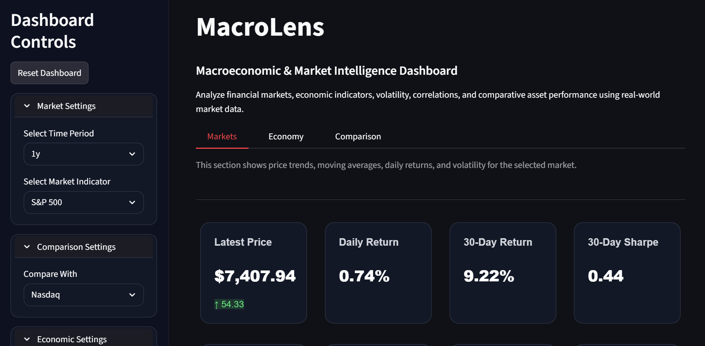
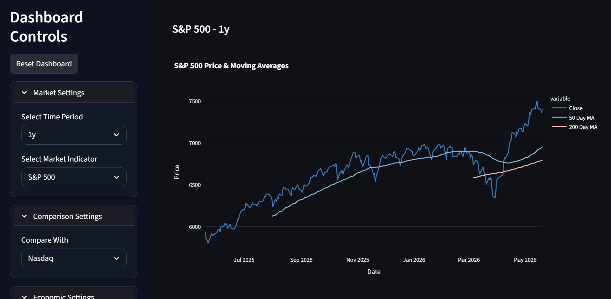
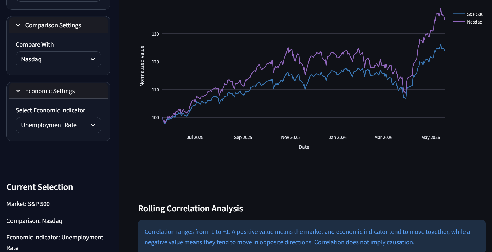
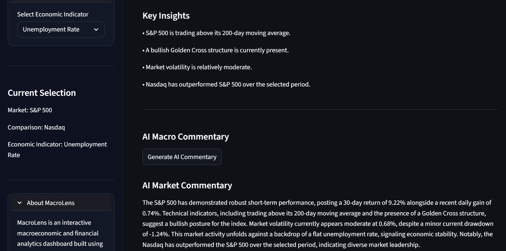

## Live Demo
[View MacroLens](https://macrolens.streamlit.app)
# MacroLens

MacroLens is an interactive macroeconomic and financial analytics dashboard built with Python, Streamlit, Plotly, yfinance, FRED, and Gemini AI.

## Features

- Market trend analysis
- Moving averages
- Daily and 30-day returns
- Volatility and drawdown tracking
- Sharpe ratio analysis
- FRED economic indicators
- Asset performance comparison
- Rolling correlation analysis
- Rule-based insights
- AI-generated macro commentary

## Tech Stack

- Python
- Streamlit
- Pandas
- Plotly
- yfinance
- FRED API
- Google Gemini API

## Data Sources

- Yahoo Finance via yfinance
- FRED Federal Reserve Economic Data

## How to Run Locally

1. Clone the repository:

```bash
git clone YOUR_REPO_LINK_HERE
cd MacroLensApp
```
2. Create and activate a virtual environment.

On Windows:
```bash
python -m venv .venv
.venv\Scripts\activate
```
On Mac/Linux:
```bash
python3 -m venv .venv
source .venv/bin/activate
```
3. Install dependencies:

```bash
pip install -r requirements.txt
```
4. Create a .env file and add your API keys:

```bash
FRED_API_KEY=your_fred_api_key_here
GEMINI_API_KEY=your_gemini_api_key_here
```
5. Run the app:
```bash
streamlit run app.py
```
## Dashboard Preview

### Market Dashboard



### Market Analysis



### Comparison Analysis



### AI Commentary



## Disclaimer

This project is for educational purposes only and should not be interpreted as financial advice.